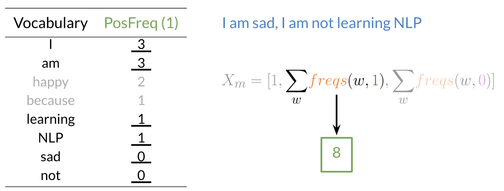
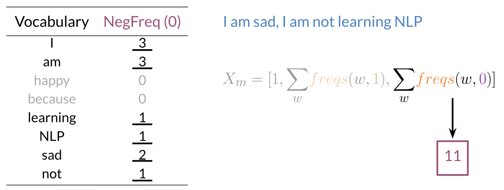
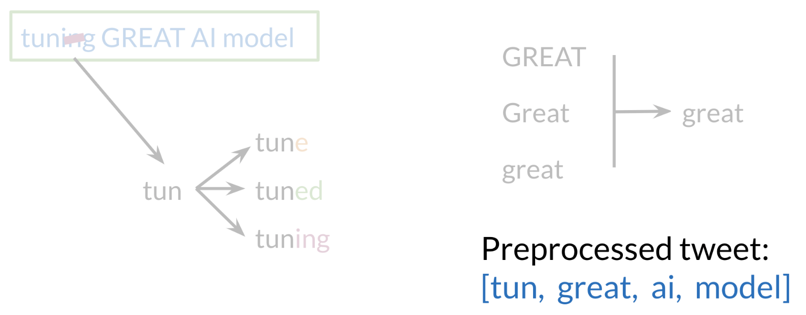
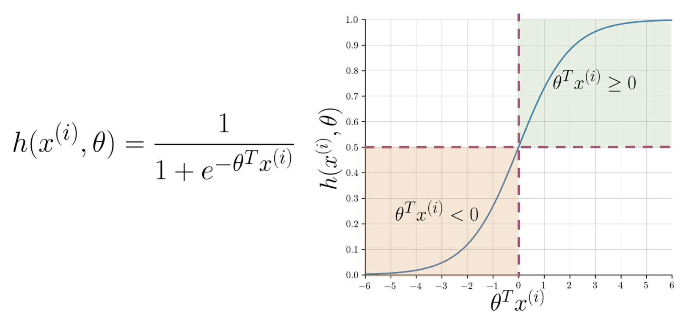
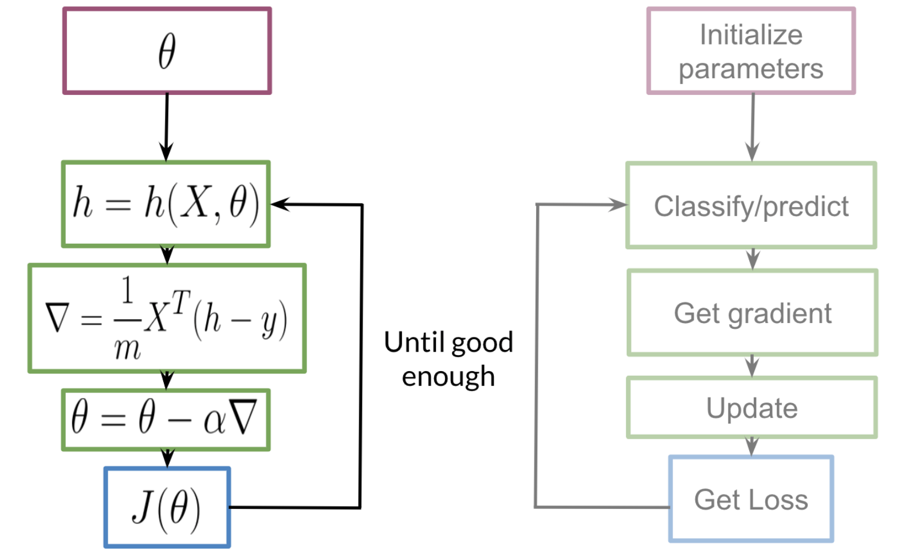
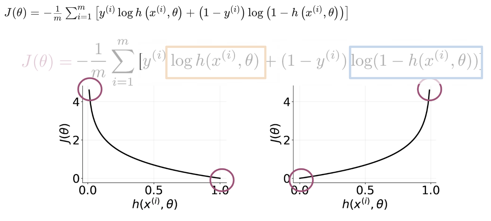

# Sentiment analysis with logistic regression

In this [module](https://www.coursera.org/learn/classification-vector-spaces-in-nlp/home/week/1), I will learn how to extract features from text into numerical vectors, then build a binary classifier for tweets using a logistic regression model.
## Table of Contents
- [Sentiment analysis with logistic regression](#sentiment-analysis-with-logistic-regression)
  - [Table of Contents](#table-of-contents)
  - [Learning Objectives](#learning-objectives)
  - [Lecture Notes](#lecture-notes)
    - [Supervised ML \& Sentiment Analysis](#supervised-ml--sentiment-analysis)
    - [Vocabulary \& Feature Extraction](#vocabulary--feature-extraction)
    - [Negative and Positive Frequencies](#negative-and-positive-frequencies)
    - [Feature Extraction with Frequencies](#feature-extraction-with-frequencies)
    - [Preprocessing](#preprocessing)
    - [Putting it all together](#putting-it-all-together)
    - [Logistic Regression](#logistic-regression)
      - [Overview](#overview)
      - [Training](#training)
      - [Testing](#testing)
      - [Cost function](#cost-function)
## Learning Objectives

- Sentiment analysis
- Logistic regression
- Data pre-processing
- Calculating word frequencies
- Feature extraction
- Vocabulary creation
- Supervised learning

## Lecture Notes

### Supervised ML & Sentiment Analysis

- We have input features $X$ and output labels $Y$
- We train a prediction function to predict labels $\hat{Y}$
- Our cost function $Cost(Y, \hat{Y})$, compares the actual output labels $Y$ to our predicted labels $\hat{Y}$
- We then use our cost function to update the parameters $\theta$ in our prediction function
  - We want to find $\theta$ values that minimize the cost function

- Classification task
  - We have a corpus tweets as inputs
  - We have a binary outcome, where tweets with positive sentiments have labels of 1 and tweets with negative sentiments have labels of 0.
- First, we need to process raw tweets and extract meaningful features $X$
- Then we can train our logistic regression model to classify tweets as positive or negative

### Vocabulary & Feature Extraction

- A simple way to represent text numerically is to represent it as a vector of dimension $|V|$
  - $|V|$ corresponds to the size of your vocabulary $V$
  - Vocabulary $V$ is the **set** of all **unique** words that appear in your text examples
- To represent a tweet, we put a 1 in the index of words present in the tweet, and 0 in the indices of the words not present in the tweet
- A drawback of this method is that our vector representations of tweets will become more and more sparse as $V$ gets larger
  - This also results in us having to learn **a lot** of model parameters, $n\theta $ parameters, which will slow down training and prediction time

### Negative and Positive Frequencies
Given a corpus of tweets that have been labeled as positive and negative:

We can create a mapping of each word in our dictionary to its appearance frequency in each sentiment

### Feature Extraction with Frequencies
- As mentioned above, one-hot encoding our entire vocabulary isn't super practical as our vocabulary grows
- We can use the sentiment-frequency dictionary introduced above to encode tweets in dimensions of 3 ($\mathbb{R}^3$). 
- The first entry in this 3D vector is 1, for the bias term that will be used in the logistic regression (more on that later).
- The second entry is the sum of the **PosFreq** values present in the tweet

- The third entry is the sum of the **NegFreq** values present in the tweet

- This results in the tweet *"I am sad, I am not learning NLP"*, to be encoded as $[1, 8, 11]$

### Preprocessing
A basic checklist for preprocessing text:
1. Eliminate handles and URLs
2. Tokenize the string into words
3. Remove stop words like "and, is, a, on, etc."
4. Stemming: convert every word to its stem ("dancer", "dancing", "danced" becomes "danc")
5. Convert all words to lower case
   
For example, the following tweet "@YMourri and @AndrewYNg are tuning a GREAT AI model at https://deeplearning.ai!!!" after preprocessing becomes

### Putting it all together
- We convert raw text into numerical representations by first preprocessing it and then performing feature extraction:

- We can then do this for $m$ tweets, giving us a matrix of vector representations of our tweets $X \in \mathbb{R}^{mx3}$

- Python pseudocode for implementing this process:

### Logistic Regression

#### Overview
- Logistic regression uses the sigmoid function to output probabilities (so outputs range between 0 and 1)
- The sigmoid function with some weight $\theta$ and some input $x^{(i)}$ is defined as follows: 

- Note that as $\theta^Tx^{(i)}$ gets closer to $-\infty$ the denominator of the sigmoid function gets larger and larger and as a result, the sigmoid gets closer to 0
- On the other hand, as $\theta^Tx^{(i)}$ gets closer to $\infty$, the denominator of the sigmoid function gets closer to 1 and as a result, the sigmoid gets closer to 1.

#### Training
- To train the logistic regression model, we can perform the following algorithm, **gradient descent**:

- In most cases, we keep training until the cost converges, for example:

#### Testing
- When it's time to get an idea of how well our model performs, we turn to assessing it's performance on unseen data
- We have a labeled data set that we held out from training: $(X_{val}, Y_{val})$
    - In reality, we split the data into three datasets $(X_{train},Y_{train}), (X_{val}, Y_{val}), (X_{test}, Y_{test})$, but keeping it simple for now
- We have our optimal model parameters that we learned from training: $\theta$
- We obtain predictions $\hat{Y}_{val}$ for the testing data $\hat{X}_{val}$ by passing the inputs into our model: $\hat{Y}_{val} = \text{sigmoid}(X_{val},\theta)$ and assigning a label of 1 if the output is over an arbitrary threshold (usually 0.5), and a label of 0 otherwise

- We can calculate our model's accuracy as $$\text{Accuracy} =  \frac{\sum_{i=1}^n (\hat{y}_{val}^{(i)}) == y_{val}^{(i)})}{n} $$

#### Cost function
- The logistic regression cost function is defined below

  

- Some things to note in the above image: 
    - The orange part of the lost function is only relevant when the label is 1
    - The blue part of the lost function is only relevant when the label is 0 
    - The negative sign is there to ensure the cost function always outputs positive values
    - The larger the cost, the worse the model is doing
- The goal is to **minimize** $J(\theta)$!