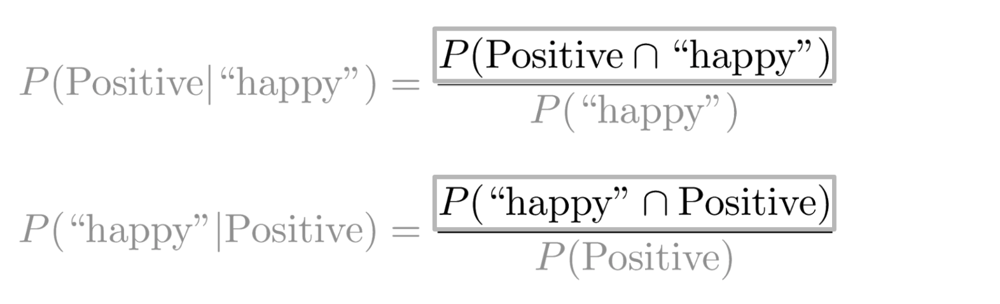

# Sentiment analysis with naive bayes

In this [module](https://www.coursera.org/learn/classification-vector-spaces-in-nlp/home/week/1), I will learn how to extract features from text into numerical vectors, then build a binary classifier for tweets using a logistic regression model.

## Table of Contents
- [Sentiment analysis with naive bayes](#sentiment-analysis-with-naive-bayes)
  - [Table of Contents](#table-of-contents)
  - [Lecture Notes](#lecture-notes)
    - [Probability and Bayes' Rule](#probability-and-bayes-rule)
    - [Bayes' Rule](#bayes-rule)
    - [Naive Bayes Introduction](#naive-bayes-introduction)
    - [Laplacian Smoothing](#laplacian-smoothing)
    - [Log Likelihood](#log-likelihood)
    - [Training Naive Bayes](#training-naive-bayes)
    - [Testing Naive Bayes](#testing-naive-bayes)
    - [Applications of Naive Bayes](#applications-of-naive-bayes)
    - [Naive Bayes Assumptions](#naive-bayes-assumptions)
    - [Error Analysis](#error-analysis)

## Lecture Notes

### Probability and Bayes' Rule
Consider the example of a corpus of tweets that have been labeled as positive and negative:

- To calculate a probability of a certain event, we sum the instances of that event by the total number of events.
- To calculate the probability of two events happening at the same time, we need to look at the intersection, or overlap of events.

### Bayes' Rule
- Conditional probabilities help us reduce the sample search space.

- If we knew the tweet was labeled happy, we would only have to look inside of the blue circle above. The numerator will be the read part and the denominator will be the whole blue circle.

- Substituting the numerator in the right hand side of the first equation yields:
  

General Bayes' Rule: $$P(X | Y) = \frac{P(Y | X) P(X)}{P(Y)} $$
### Naive Bayes Introduction
- To build a classifier, we first need to start by calculating conditinal probabilities given our frequency table:

- Once we have the probabilities, we can compute the likelihood scores like this:
  

- A score greater than 1 indicates that the class is positive, otherwise it is negative

### Laplacian Smoothing
- Recall the probability of a word given a class: $$P(w_i | \text{class}) = \frac{\text{freq}(w_i, \text{class})}{N_{\text{class}}} $$
- However, if a word does not appear in the training, then it automatically gets a probability of 0, to fix this we add smoothing as follows: $$ P(w_i | \text{class}) = \frac{\text{freq}(w_i, \text{class}) + 1}{N_{\text{class}} + V} $$

### Log Likelihood

- To compute the log likelihood, we need to get the ratios and use them to compute a score that will allow us to decide whether a tweet is positive or negative. The higher the ratio, the more positive the word is:

- To do inference, you can compute the following $$\frac{P(pos)}{P(neg)} \Pi_{i=1}^m \frac{P(w_i | pos)}{P(w_i | neg)} > 1 $$
- As $m$ gets larger, we can get numerical underflow issues, so we take the **log** which gives us the following: $$ log\frac{P(pos)}{P(neg)} \sum_{i=1}^m log\frac{P(w_i | pos)}{P(w_i | neg)}$$ 
- The first component above is called the **log-prior** and the second is the **log-likelihood**
- We further introduce $\lambda$ as follows:

- We can then use these values to easily calculate the log-likelihood

### Training Naive Bayes

There are five steps to training the naive Bayes classifiers:
1. Get or annotate a dataset with positve and negative tweets
2. Preprocess the tweets: process_tweet(tweet) --> [w1, w2, w3, ...]:
   1. Lowercase words
   2. Remove punctuation, urls, names
   3. Remove stop words
   4. Stemming
   5. Tokenize sentences
3. Compute freq(w, class):
   
4. Get $P(w | pos), P(w | neg)$ using the table above
5. Get $\lambda(w)$
   $$ \lambda(w) = \log\frac{P(\text{w | pos})}{P(\text{w | neg})} $$
6. Compute $logprior = \log\frac{P(pos)}{P(neg)}$
$$\text{logprior} = \log\frac{D_{pos}}{D_{neg}} $$ where $D_{pos}$ and $D_{neg}$ correspond to the number of positive and negative documents respectively

### Testing Naive Bayes

We can make predictions on unseen tweets like so:

### Applications of Naive Bayes

The Bayes Rule and Naive Bayes have numerous applications in classification tasks such as:

* Author identification
* Spam filtering
* Information retrival
* Word disambiguation

Just keep in mind that Naive Bayes is often used as a **simple baseline** model.
It's also really fast.

### Naive Bayes Assumptions

Naive Bayes makes the independence assumption and is affected by the word frequencies in our corpus. For example, if we had the following examples:

In the image on the left, words like "hot" and "sunny" are likely to depend on each other and are correlated to a certain extent with the word "desert".
In the image on the right, a Naive Bayes model would fill in the blank with "summer", "spring", "fall", or "winter" with equal probability.

Naive Bayes also makes the assumption of relative frequencies of words in a corpus.
This is often violated on Twitter, where there tend to be more positive tweets than negative tweets.

### Error Analysis

There are several mistakes that could cause you to missclasify an example or a tweet. For example,

* Removing punctuation
* Removing words

* Word order

* Adversarial attacks (sarcasm, irony, euphemisms)