# Vector Space Models

In this [module](https://www.coursera.org/learn/classification-vector-spaces-in-nlp/home/week/3), I will learn how vector space models capture semantic meaning and relationships between words. I'll learn how to create word vectors that capture dependencies between words, then visualize their relationships in two dimensions using PCA.

## Table of Contents
- [Vector Space Models](#vector-space-models)
  - [Table of Contents](#table-of-contents)
  - [Lecture Notes](#lecture-notes)
    - [Vector Space Models](#vector-space-models-1)
    - [Word by Word and Word by Doc](#word-by-word-and-word-by-doc)
      - [Word by Word Design](#word-by-word-design)
      - [Word by Document design](#word-by-document-design)
    - [Euclidean Distance](#euclidean-distance)
    - [Cosine Similarity: Intuition](#cosine-similarity-intuition)
    - [Cosine Similarity](#cosine-similarity)
    - [Manipulating Words in Vector Spaces](#manipulating-words-in-vector-spaces)
    - [Visualization and PCA](#visualization-and-pca)
    - [PCA algorithm](#pca-algorithm)

## Lecture Notes

### Vector Space Models
Vector spaces are fundamental in many applications in NLP. 
If you were to represent a word, document, tweet, or any form of text, you will probably be encoding it as a vector. 
These vectors are important in tasks like information extraction, machine translation, and chatbots. 
Vector spaces could also be used to help you identify relationships between words as follows: 

The famous quote by Firth says, **"You shall know a word by the company it keeps"**. 
When learning these vectors, you usually make use of the neighboring words to extract meaning and information about the center word. 
If you were to cluster these vectors together, you will see that adjectives, nouns, verbs, etc. tend to be near one another. 
Another cool fact, is that synonyms and antonyms are also very close to one another. 
This is because you can easily interchange them in a sentence and they tend to have similar neighboring words!

### Word by Word and Word by Doc
#### Word by Word Design
Assume that you are trying to come up with a vector that will represent a certain word.  
One possible design would be to create a matrix where each row and column corresponds to a word in your vocabulary.
Then you can iterate over a document and see the number of times each word shows up next each other word. 
You can keep track of the number in the matrix. r
The hyperparameter $K$ is the bandwidth that decides whether two words are next to each other or not. 

#### Word by Document design
You can now apply the same concept and map words to documents. 
The rows could correspond to words and the columns to documents. 
The numbers in the matrix correspond to the number of times each word showed up in the document. 

You can represent the entertainment category, as a vector $
v=[500,7000]$. 
You can then also compare categories as follows by doing a simple plot. 

### Euclidean Distance
Assume we want to compute the distance between two points: $A, B$.
One way of doing this is to calculate the euclidean distance $d$ defined as $$d(A,B) = \sqrt{(B_1 - A_1)^2 + (B_2 - A_2)^2}$$

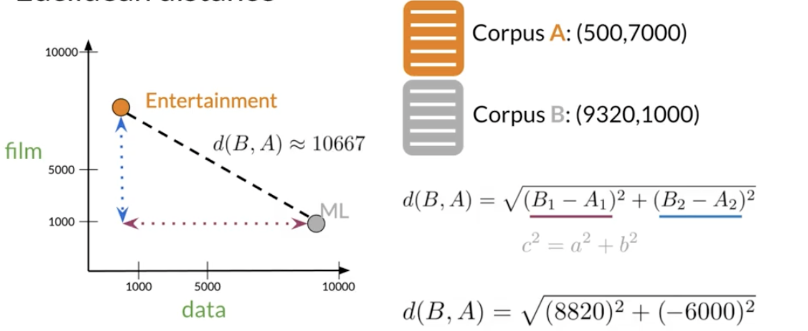

We can generalize the distance calculation to $n$ dimensions by redefining $d$ as $$ d(\vec{v}, \vec{w}) = \sqrt{\sum_{i=1}^n (v_i - w_i)^2} $$

An example of this calculation follows:

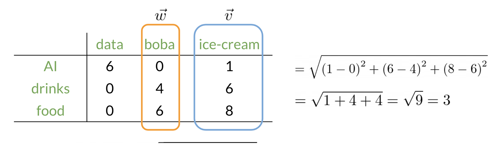
### Cosine Similarity: Intuition
One of the issues with euclidean distance is that it is not always accurate for the type of comparisons we would like to make.
For example, when comparing large documents to smaller ones with euclidean distance one could get an inaccurate result. Look at the diagram below:

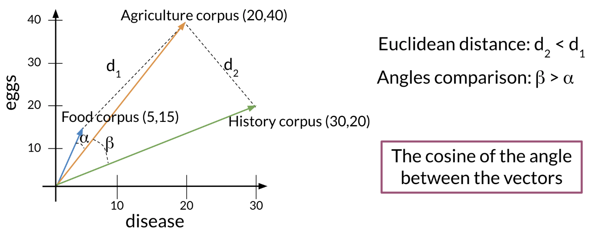

Normally you may expect the **food** and the **agriculture** corpus to be more similar because they have the same proportion of words.
However, the food corpus is much smaller than the agriculture corpus.
So although the **history** corpus and the agriculture corpus are different, they have a smaller euclidean distance (i.e., $d_2 < d_1$).

To solve this problem, we can look at the cosine between the angles of the vectors.
This allows us to now compare angles $\alpha, \beta$.
### Cosine Similarity
Just as a refresher, recall that the **norm** of a vector is defined as $$|| v || = \sqrt{\sum_{i=1}^n |v_i|^2} $$

And that the dot product between two vectors is defined: $$\vec{v} \cdot \vec{w} = \sum_{i=1}^n v_i \cdot w_i $$
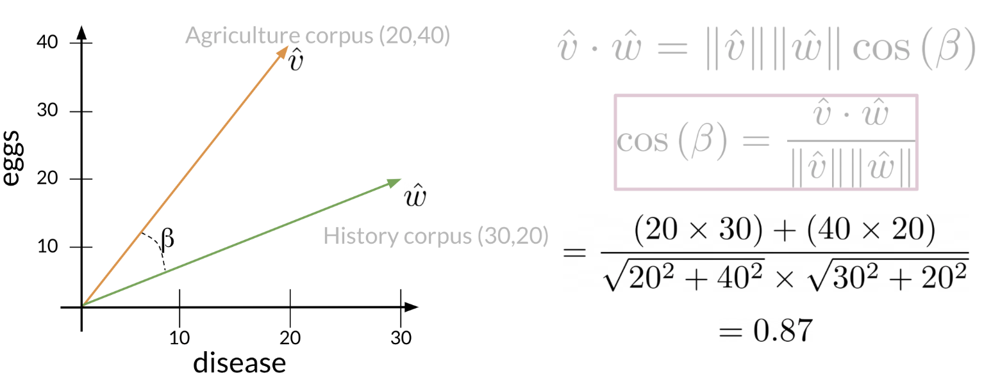

So we have the following cosine similarity equation: $$\cos(\beta) = \frac{\hat{v}\cdot \hat{w}}{||\hat{v}|| || \hat{w}||} $$

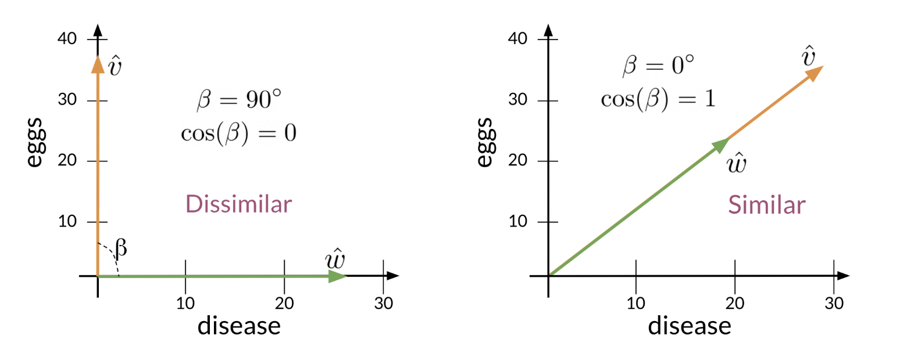

If $\hat{v}$ and $\hat{w}$ are the same, then you get the numerator to be equal to the denominator, and $\beta = 0$.
On the other hand, the dot product of two orthogonal vectors is 0 when $\beta = 90$.
### Manipulating Words in Vector Spaces
We can use word vectors to extract patterns and identify certain structures in text.

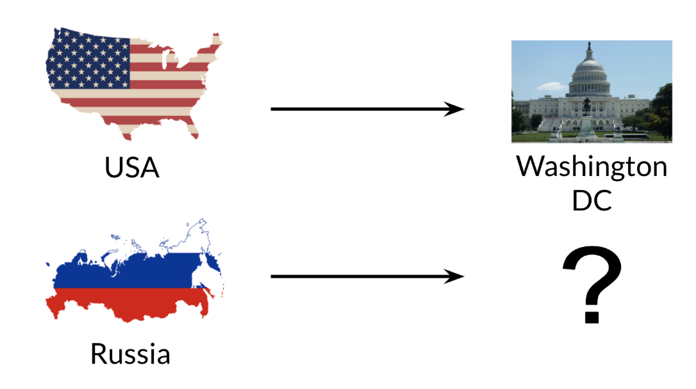

You can use the word **vector** for Russia, USA, and DC to actually compute a **vector** that would be very similar to that of Moscow. 
You can then use cosine similarity of the vector with all the other word vectors you have and you can see that the vector of Moscow is the closest. 

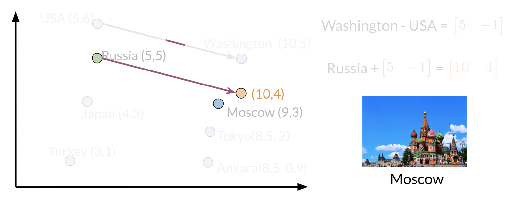

Note that the distance (and direction) between a country and its capital is relatively the same. 
Hence manipulating word vectors allows you identify patterns in the text. 

### Visualization and PCA
Principal component analysis (PCA) is an unsupervised learning algorithm which can be used to reduce the dimension of your data. 
As a result, it allows you to visualize your data in two dimensions. It tries to combine variances across features. 
Here is a concrete example of PCA: 

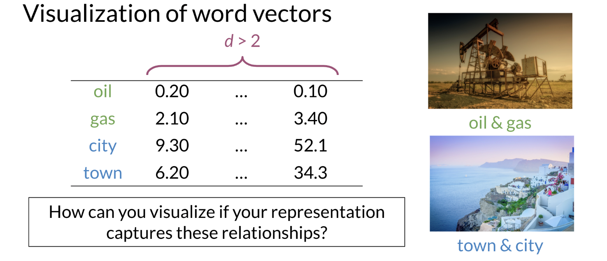

Note that when doing PCA on this data, you will see that oil & gas are close to one another and town & city are also close to one another.
To plot the data you can use PCA to go from $d > 2$ dimensions to $d = 2$

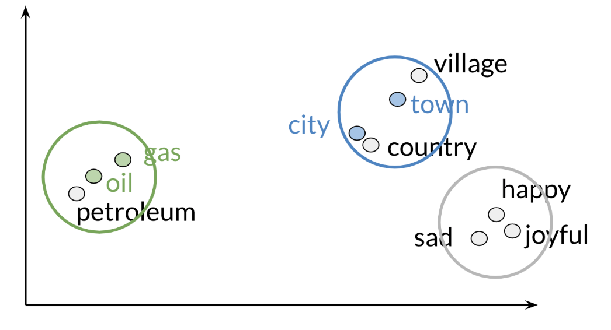

These are the results of plotting a couple of vectors in two dimensions. 
Note that words with similar part of speech (POS) tags are next to one another. 
This is because many of the training algorithms learn words by identifying the neighboring words. 
Thus, words with similar POS tags tend to be found in similar locations. 
An interesting insight is that synonyms and antonyms tend to be found next to each other in the plot. Why is that the case?

### PCA algorithm
PCA is commonly used to reduce the dimension of your data. 
Intuitively the model collapses the data across principal components. 
You can think of the first principal component (in a 2D dataset) as the line where there is the most amount of variance. 
You can then collapse the data points on that line. 
Hence you went from 2D to 1D. 
You can generalize this intuition to several dimensions. 

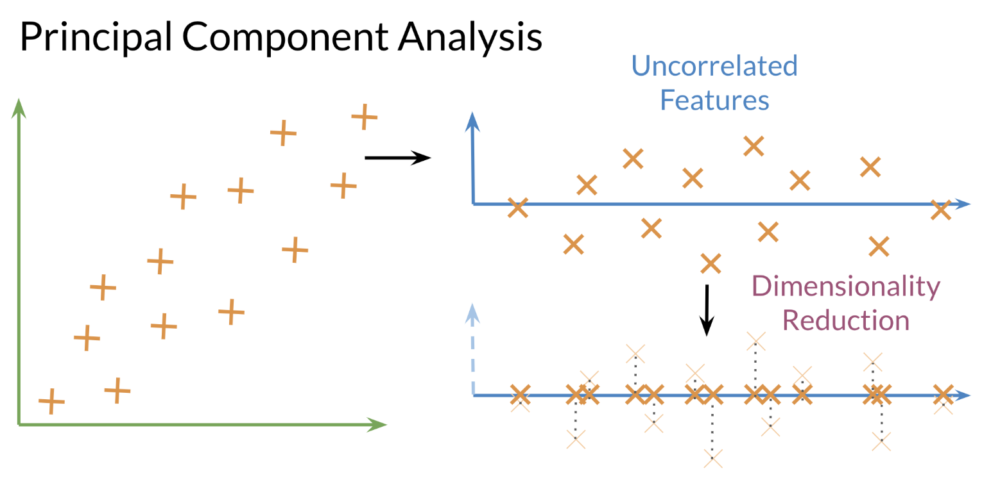

Some important definitions for understanding PCA:
- **Eigenvector**: the resulting vectors, also known as the uncorrelated features of your data

- **Eigenvalue**: the amount of information retained by each new feature (you can think of it as the variance in the eigenvector)

Also each eigenvalue has a corresponding eigenvector.
The eigenvalue tells you how much variance there is in the eigenvector.
Here are the steps required to compute PCA: 

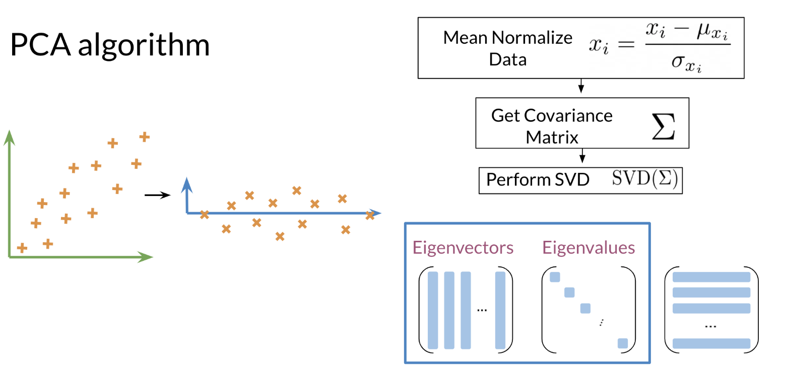

**Steps to Compute PCA:**
- Mean normalize your data
- Compute the covariance matrix $\Sigma$
- Compute Singular Value Decomposition (SVD) on your covariance matrix
  - This returns $[USV] = SVD(\Sigma)$
- You can then use the first $n$ columns of $U$, to get your new data by multiplying $XU[:, 0 : n]$