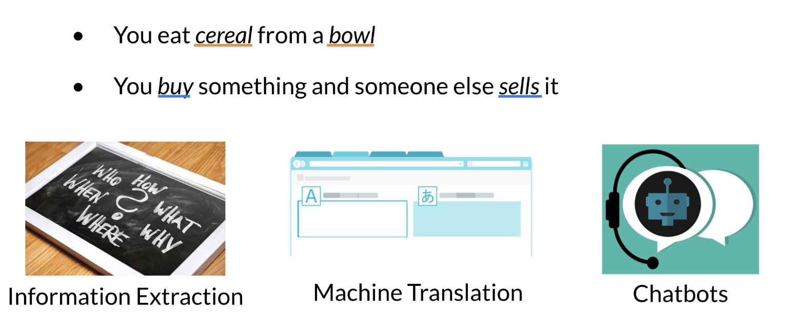
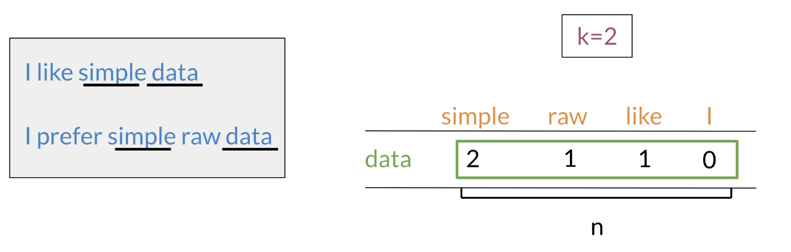
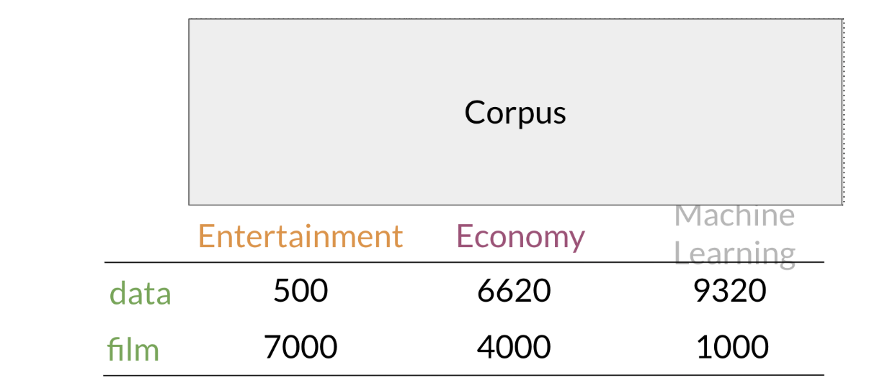
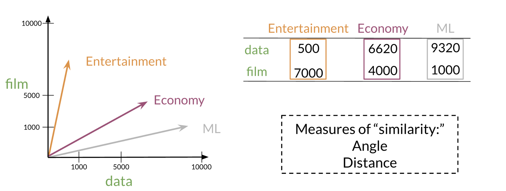

# Vector Space Models

In this [module](https://www.coursera.org/learn/classification-vector-spaces-in-nlp/home/week/3), I will learn how vector space models capture semantic meaning and relationships between words. I'll learn how to create word vectors that capture dependencies between words, then visualize their relationships in two dimensions using PCA.

## Table of Contents
- [Vector Space Models](#vector-space-models)
  - [Table of Contents](#table-of-contents)
  - [Lecture Notes](#lecture-notes)
    - [Vector Space Models](#vector-space-models-1)
    - [Word by Word and Word by Doc](#word-by-word-and-word-by-doc)
      - [Word by Word Design](#word-by-word-design)
      - [Word by Document design](#word-by-document-design)
    - [Euclidean Distance](#euclidean-distance)
    - [Cosine Similarity: Intuition](#cosine-similarity-intuition)
    - [Cosine Similarity](#cosine-similarity)
    - [Manipulating Words in Vector Spaces](#manipulating-words-in-vector-spaces)
    - [Visualization and PCA](#visualization-and-pca)
    - [PCA algorithm](#pca-algorithm)

## Lecture Notes

### Vector Space Models
Vector spaces are fundamental in many applications in NLP. 
If you were to represent a word, document, tweet, or any form of text, you will probably be encoding it as a vector. 
These vectors are important in tasks like information extraction, machine translation, and chatbots. 
Vector spaces could also be used to help you identify relationships between words as follows: 

The famous quote by Firth says, **"You shall know a word by the company it keeps"**. 
When learning these vectors, you usually make use of the neighboring words to extract meaning and information about the center word. 
If you were to cluster these vectors together, you will see that adjectives, nouns, verbs, etc. tend to be near one another. 
Another cool fact, is that synonyms and antonyms are also very close to one another. 
This is because you can easily interchange them in a sentence and they tend to have similar neighboring words!

### Word by Word and Word by Doc
#### Word by Word Design
Assume that you are trying to come up with a vector that will represent a certain word.  
One possible design would be to create a matrix where each row and column corresponds to a word in your vocabulary.
Then you can iterate over a document and see the number of times each word shows up next each other word. 
You can keep track of the number in the matrix. r
The hyperparameter $K$ is the bandwidth that decides whether two words are next to each other or not. 

#### Word by Document design
You can now apply the same concept and map words to documents. 
The rows could correspond to words and the columns to documents. 
The numbers in the matrix correspond to the number of times each word showed up in the document. 

You can represent the entertainment category, as a vector $
v=[500,7000]$. 
You can then also compare categories as follows by doing a simple plot. 

### Euclidean Distance

### Cosine Similarity: Intuition

### Cosine Similarity

### Manipulating Words in Vector Spaces

### Visualization and PCA

### PCA algorithm