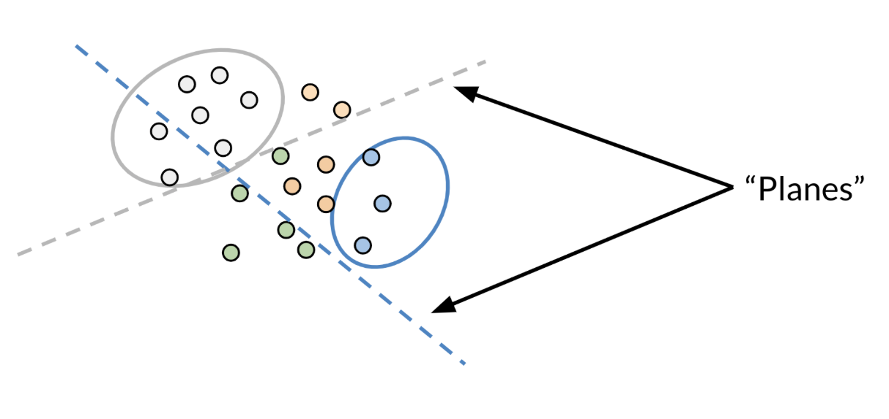

# Machine Translation and Document Search

In this [module](https://www.coursera.org/learn/classification-vector-spaces-in-nlp/home/week/4), I will learn how to transform word vectors and assign them to subsets using locality sensitive hashing, in order to perform machine translation and document search.

## Table of Contents
- [Machine Translation and Document Search](#machine-translation-and-document-search)
  - [Table of Contents](#table-of-contents)
  - [Lecture Notes](#lecture-notes)
    - [Transforming word vectors](#transforming-word-vectors)
    - [K-nearest neighbors](#k-nearest-neighbors)
    - [Hash tables and hash functions](#hash-tables-and-hash-functions)
    - [Locality sensitive hashing](#locality-sensitive-hashing)
    - [Multiple planes](#multiple-planes)
    - [Approximate nearest neighbors](#approximate-nearest-neighbors)
    - [Searching documents](#searching-documents)

## Lecture Notes

### Transforming word vectors

Consider the case of transforming a word in English to its French translation:

Note that the word "chat" in French means cat. 
You can learn that by taking the  vector corresponding to "cat" in English, multiplying it by a matrix that you learn and then you can use cosine similarity between the output and all the French vectors. 
You should see that the closest result is the vector which corresponds to "chat".
We can visualize the alignment of these vectors as such:

In this example, $X$ corresponds to the matrix of English word vectors, $Y$ corresponds to the matrix of French word vectors, and $R$ is the mapping matrix that we would like to learn.

**Steps required to learn $R$:**

* Initialize $R$
* In a for loop:
  * $Loss = \lVert XR - Y \rVert_F$
  * Find the gradient of $Loss$ with respect to $R$: $g = \frac{d}{dR}Loss$
  * Update $R$: $R = R - \alpha \cdot g$

In summary, we are making use of the following:
* $XR \approx Y$
* $\text{minimize} \lVert XR - Y \rVert ^2 _F$

### K-nearest neighbors

After you have computed the output of $XR$, you get a vector. 
You then need to find the most similar vectors to your output. 
We can do this by finding the vectors closest to the output of $XR$.
Here is a visual example:

### Hash tables and hash functions

You can think of hash function as a function that takes data of arbitrary sizes and maps it to a fixed value. 
The values returned are known as *hash values* or *even hashes*. 

### Locality sensitive hashing

Locality sensitive hashing is a technique that allows you to hash similar inputs into the same buckets with high probability. 

Instead of the typical buckets we have been using, you can think of clustering the points by deciding whether they are above or below the line. 
Now as we go to higher dimensions (say n-dimensional vectors), you would be using planes instead of lines. Let's look at a concrete example: 

Given some point at $(1,1)$ and three vectors $V_1 = (1,2), V_2 = (-1,1), V_3 = (-2,-1)$ notice what happens when we take the dot product.
First note that the dashed line is our plane.
The vector with point $P = (1,1)$ is perpendicular to that line (plane).
Now any vector above the dashed line that is multiplied by $(1,1)$ would have a positive number.
Any vector below the dashed line with $(1,1)$ will have a negative number.
Any vector on the dashed line multiplied by $(1,1)$ will give you a dot product of 0.

When you take the dot product of a vector $V_1$ and a $P$, then you take the magnitude or length of that vector, you get the black line (labeled as Projection).
The sign indicates on which side of the plane the projection vector lies.

### Multiple planes

You can use multiple planes to get a single hash value. Let's take a look at the following example: 

Given some point denoted by $v$, you can run it  through several projections $P_1, P_2, P_3$ to get one hash value.
If you compute $P_1v^T$ you get a positive number, so you set $h_1 = 1$.
$P_2v^T$ gives you a positive number so you get $h_2=1$.
$P_3v^T$ is a negative number so you set $h_3$ to be 0.
You can then compute the hash value as follows $$hash = 2^0 \cdot h_1 + 2^1 \cdot h_2 + 2^2 \cdot h_3 $$
$$= 1 \cdot 1 + 2 \cdot 1 + 4 \cdot 0 = 3$$

Another way to think of it, is at each time you are asking the plane to which side will you find the point (i.e. 1 or 0) until you find your point bounded by the surrounding planes. The hash value is then defined as: $$hash = \sum_{i}^{H} 2^i \cdot h_i $$

### Approximate nearest neighbors

Approximate nearest neighbors does not give you the full nearest neighbors but gives you an approximation of the nearest neighbors.
It usually trades off accuracy for efficiency. 
Look at the following plot: 

You are trying to find the nearest neighbor for the red vector (point). 
The first time, the plane gave you green points. 
You then ran it a second time, but this time you got the blue points. 
The third time you got the orange points to be the neighbors. 
So you can see as you do it more times, you are likely to get all the neighbors. 
Here is the code for one set of random planes. 

### Searching documents

Consider the following code snippet for embedding documents in vector space, which enables search of documents in the methods mentioned above:

